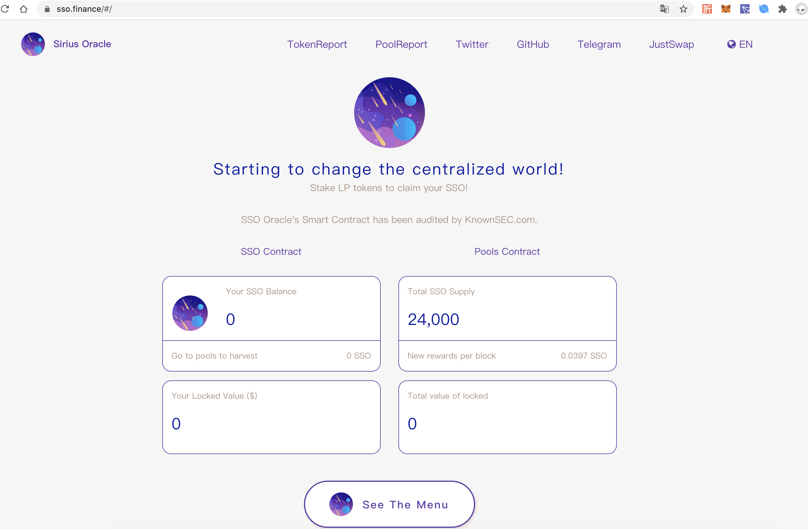
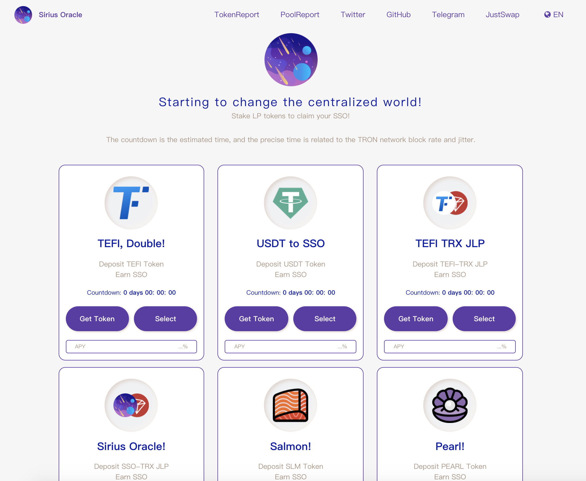
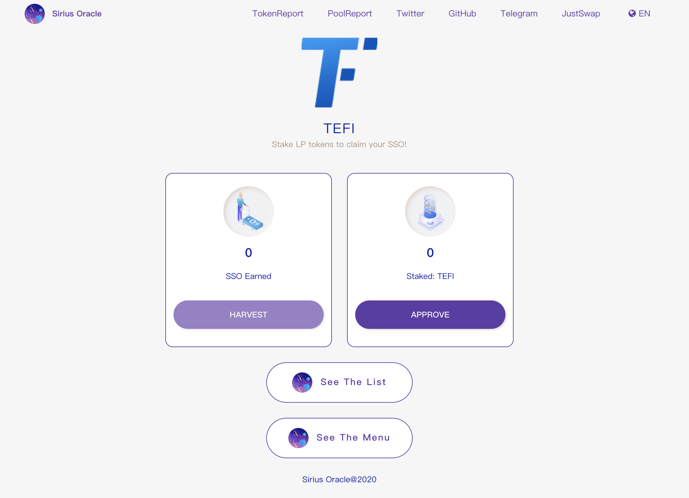
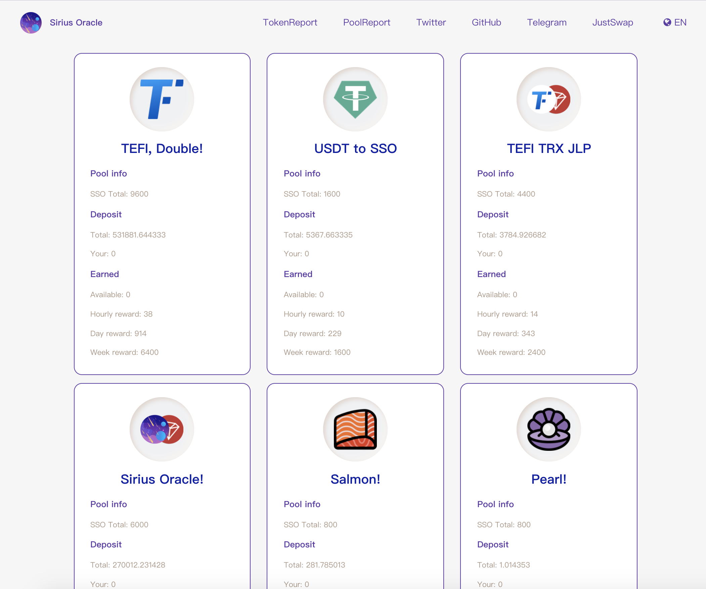

## SealSC Outsourcing Project

If you need technical development services, please go to: https://sealsc.com/  .  
如果有开发需求，请联系：https://sealsc.com/ 。



https://sso.finance/#/







#### Code update in progress, so stay tuned.

#### Project setup
```
yarn install
```

##### Compiles and hot-reloads for development
```
yarn run serve
```

##### Compiles and minifies for production
```
yarn run build
```

##### Run your tests
```
yarn run test
```

##### Lints and fixes files
```
yarn run lint
```

#### Customize configuration
See [Configuration Reference](https://cli.vuejs.org/config/).
